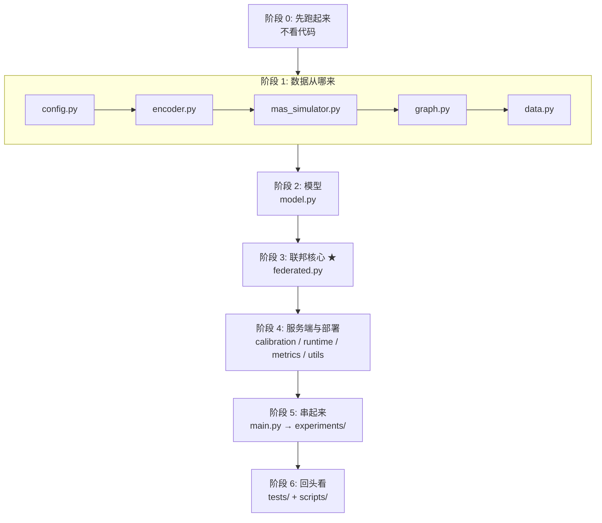

# 阅读顺序（按这个顺序看，每步都不会卡住）

> 目标读者：想搞懂"联邦学习到底怎么落成代码"的人。
> 全程约 3-4 小时，分 6 个阶段。**不要按目录顺序读**，依赖关系决定了下面的顺序。

## 依赖图（箭头 = "读它之前要先读")



---

## 阶段 0：先跑起来（15 分钟，不看代码）

```bash
/home/yix/torch_venv/bin/python tests/test_components.py    # 17/17 通过
/home/yix/torch_venv/bin/python main.py                     # 打印全流程结果
```

**先记住这 5 行输出**，后面读代码时会不断回到它：

```
off-the-shelf 0.43  <  local-only 0.68  <  FedAvg 0.76 ≈ FGLGuard 0.76  <  centralized 0.89
```

读完之后你要能回答：**为什么 off-the-shelf 会输给 local-only？**（答案在阶段 1 的 `encoder.py`）

---

## 阶段 1：数据从哪来（联邦的数据基础）

### 第 1 步 · `fglguard/config.py`

| 看什么 | 为什么 |
|---|---|
| `VocabConfig` 全部字段 | 词表怎么分块 —— 这是后面所有"域偏移"现象的根源 |
| `SimConfig.propagation_prob` / `decay` / `delivery_prob` | 攻击怎么传播、标签怎么定（这三个参数最敏感） |
| `FedConfig` 全部字段 | **联邦的超参都在这**：`n_clients`(K)、`n_rounds`(R)、`local_epochs`(E)、`proximal_mu`(μ)、`label_skew_purity`(p) |
| `CalibConfig.over_refusal_budget` | 就是论文的 ρ |
| `default_config()` / `small_config()` | 两套规模：完整版 vs 冒烟版 |

> **读完后要能回答**：如果我想把客户端从 4 个改成 8 个，改哪个字段？

### 第 2 步 · `fglguard/encoder.py`（很短，先读）

- `FrozenEncoder.__init__` → 随机嵌入表，**不参与训练**（"冻结"的含义）
- `embed_text` → 一条话语 → 一个向量（空话语给零向量）
- `sample_*_tokens` / `payload_token_set` → 仿真器采样用

> **这是第一个"啊哈"点**：因为 `benign_range(0)` 和 `benign_range(1)` 完全不重叠，
> 域 0 上训出来的判别方向对域 1 毫无意义 → 阶段 0 看到的 off-the-shelf 失败就是这么来的。

### 第 3 步 · `fglguard/mas_simulator.py`（本项目最长的一个文件）

按这个顺序读内部：

1. `Episode`（dataclass）—— 先看**数据结构**，字段都有注释
2. `MASSimulator._sample_topology` / `_final_agent` —— 图长什么样
3. `MASSimulator.sample_episode` —— **核心**，看懂感染如何逐跳传播
4. 末尾的 `label = int(self_infected or upstream_infected)` —— 标签的定义
5. `generate` / `generate_split` / `positive_rate` / `compromise_breakdown`

> **读完后要能回答**：
> - 一个 episode 被判 unsafe 的**充要条件**是什么？
> - `direct_exposure` 和"仅上游暴露"有什么区别，为什么这个区别很重要？
> - `injection_mode="direct"` 是给谁造数据用的？

### 第 4 步 · `fglguard/graph.py`（论文 Sec.3 的落点）

- `EpisodeGraph` → 先看数据结构，字段注释标了 `(n,d)` / `(n,n,d)` 形状
- `build_graph` → **只看两行注释**：节点特征是"自身话语历史的时间均值"，边特征承载"接收方"的嵌入
- `corroborated_scores` → 论文 Eq.(8)，只有 4 行

> **读完后要能回答**：为什么论文要特意偏离 G-Safeguard 的"聚合入边"做法？

### 第 5 步 · `fglguard/data.py`

- `ClientData` / `FederatedData` → 客户端持有什么
- `_select_with_purity` → 怎么造"标签偏斜纯度 p"
- `_take` → 为什么用"无放回"（保证客户端之间数据不重叠）
- `build_federated_data` → 两个分支：`same_domain=True`（论文 Table 1）/ `False`（Q3）
- `GraphBatch` / `collate_graphs` → 只是把图 padding 成规则张量，可以最后看

> **读完后要能回答**：`label_skew_purity=0.8` 具体是怎么在数据里体现的？

---

## 阶段 2：模型（第 6 步 · `fglguard/model.py`）

1. `EdgeFeaturedGATLayer.forward` → 对照论文 Eq.(2-4)，**注意 `softmax(dim=1)` 是沿"源节点"归一化**
2. `FGLGuardScorer` → 两层堆叠 + 线性头
3. `node_bce_loss` → 损失函数，注意 `node_mask` 处理 padding
4. `episode_scores` → episode 级分数怎么从 final-answer agent 读出

> **读完后要能回答**：为什么第二层的输入维度必须是 `hidden_dim * n_heads`？

---

## 阶段 3：联邦核心 ★ 最重要（第 7 步 · `fglguard/federated.py`）

**这个文件就是整个项目的答案。** 按这个顺序读：

| 顺序 | 符号 | 对应论文 | 读的时候想什么 |
|---|---|---|---|
| 7.1 | `FederatedClient` + `ClientData` | — | 客户端持有私有数据；**原始图永远不出去** |
| 7.2 | `FederatedClient.local_train` | Eq.(5) | 本地 SGD + 近端项 `μ/2‖θ-θ⁽ʳ⁾‖²`。这是"客户端"的全部 |
| 7.3 | `aggregate_states` | Eq.(6) 右半 | 就是加权平均，10 行 |
| 7.4 | `domain_balanced_weights` | Eq.(6) 左半 | **域内按量加权、域间等质量** |
| 7.5 | `volume_weights` | FedAvg | 对照组；`D=1` 时两者等价（论文 Prop.1） |
| 7.6 | `train_federated`（`:270` 起的 for 循环） | Algorithm 1 | **主循环：广播 → 本地训练 → 收集 → 聚合 → 评测** |
| 7.7 | `collect_validation` | Eq.(7) 的输入 | 服务端只收 `(分数, 标签)`，不收数据 |
| 7.8 | `train_local_only` / `train_centralized` / `train_supervised` | 基线 | 三个对照臂 |

> **这一阶段结束后你要能回答**（也是我上次给你的 1-10 关注点）：
> - 哪一行是"参与方选择"？（答：没有，就是 `for c in clients`）
> - 哪一行是"通信"？（答：没有，`load_state_dict` / `append` 就是）
> - 哪一行是"隐私边界"？（答：`state_dict()` 和 `(scores, labels)` 这两个返回值）

---

## 阶段 4：服务端扩展与部署

### 第 8 步 · `fglguard/calibration.py`（论文 Eq.7）

- `calibrate_threshold` → 网格搜索 τ*，注意 `tie_break` 那个注释（论文正文 vs Prop.2 的矛盾）
- `benign_quantile_threshold` → Prop.2 的闭式解，测试里用来对照
- `pool_client_validation_scores` → 分数池化

### 第 9 步 · `fglguard/runtime.py`（论文 Eq.8-9，部署态）

- `sanitizing_rewrite` → 模拟 LLM 的安全重写
- `Decision` → 三种动作 release / rewrite / refuse
- `RuntimeGuard.score_graph` / `corroborate` / `decision_score` / **`intervene`（核心）**
- `evaluate_runtime` → ASR / utility / over-refusal 的口径定义

### 第 10 步 · `fglguard/metrics.py`（短）

`auroc`（手写 rank 统计量）、`confusion_at`、`wilson_interval`、`ece`

### 第 11 步 · `fglguard/utils.py`（短）

`set_seed` / `format_table` / `plot_*` —— 纯工具，扫一眼即可

---

## 阶段 5：把上面串起来

### 第 12 步 · `main.py`

一屏看完：`World(...)` → `train_federated` → `calibrate_threshold` → 对比各臂 → `evaluate_runtime`。
**这就是论文 Figure 2 的代码版。**

### 第 13 步 · `experiments/common.py`

`World` 类 = 把"编码器 + 仿真器 + 客户端 + 测试批次"打包，避免每个脚本重复搭环境。

### 第 14 步 · `experiments/run_federation.py` → 第 15 步 · `experiments/run_runtime.py`

- `run_single_seed` = 跑完 6 个对照臂（论文 Table 1）
- `run_runtime` 的 `make_arms()` = 各臂各自校准 + 3 组运行时消融（论文 Fig.4 / Sec 5.3）

---

## 阶段 6：回头看

- **第 16 步 · `tests/test_components.py`** —— 17 项测试，每项锚定论文一个公式/命题。
  配合 README §2.6 的对照表看，**这是最快的"验收清单"**。
- **第 17 步 · `scripts/make_figures.py`** —— 从 JSON 重绘图的例子（教你结果怎么解耦）
- **第 18 步 · `scripts/pdf_to_text.py`** —— 无关紧要的小工具

---

## 附：论文符号 ↔ 代码变量对照表

读论文和读代码之间最容易卡住的就是"这个符号在代码里叫什么"：

| 论文符号 | 含义 | 代码里的名字 | 位置 |
|---|---|---|---|
| $G=(X,A,E)$ | episode 属性图 | `EpisodeGraph.x` / `.adj` / `.edge_feat` | `graph.py` |
| $\phi(\cdot)$ | 冻结句编码器 | `FrozenEncoder` / `encoder.embed_text` | `encoder.py` |
| $n$ | 团队 agent 数 | `Episode.n_agents` / `graph.n_agents` | `mas_simulator.py` |
| $T$ | 对话轮数 | `SimConfig.n_rounds` | `config.py` |
| $K$ | 客户端数 | `FedConfig.n_clients` | `config.py` |
| $D_k$ | 客户端 k 的私有图集合 | `ClientData.train` | `data.py` |
| $N_k$ | 客户端 k 的节点数 | `FederatedClient.n_nodes` | `federated.py` |
| $\theta$ | 全局模型参数 | `model.state_dict()` | `federated.py` |
| $\theta^{(r)}$ | 第 r 轮的全局参数 | `train_federated` 里的 `global_state` | `federated.py` |
| $\mu$ | 近端系数 | `FedConfig.proximal_mu` / `local_train(mu=...)` | `config.py` |
| $\alpha_k$ | 聚合权重 | `domain_balanced_weights()` 的返回值 `weights` | `federated.py` |
| $d(k)$ / $C_d$ | 域 / 域内客户端集合 | `FederatedClient.domain` | `federated.py` |
| $p$ | 标签偏斜纯度 | `FedConfig.label_skew_purity` | `config.py` |
| $R$ / $E$ | 联邦轮数 / 本地 epoch | `FedConfig.n_rounds` / `local_epochs` | `config.py` |
| $V$ | 验证分数池 | `TrainResult.val_scores` / `val_labels` | `federated.py` |
| $\rho$ | 过拒答预算 | `CalibConfig.over_refusal_budget` | `config.py` |
| $\tau^*$ | 校准出的阈值 | `CalibrationResult.tau` / `RuntimeGuard.tau` | `calibration.py` |
| $s_j$ | 节点原始风险分 | `FGLGuardScorer.forward` 的 `probs` | `model.py` |
| $\hat s_j$ | 佐证分数（Eq.8） | `RuntimeGuard.corroborate(...)` 的返回值 | `runtime.py` |
| $u_j$ / $u'_j$ | 原话语 / 重写后话语 | `episode.utterances[-1][j]` / `sanitizing_rewrite(...)` | `runtime.py` |
| $\Pi(\cdot)$ | 处置算子（Eq.9） | `RuntimeGuard.intervene` | `runtime.py` |

---

## 一句话总结

**第 7 步（`federated.py` 的 `train_federated`）就是联邦学习的全部骨架**，
其余文件都是在给它准备输入（阶段 1-2）或处理它的输出（阶段 4-5）。
如果时间有限，**只读第 3、5、7 步**也能拿到 80% 的理解。
